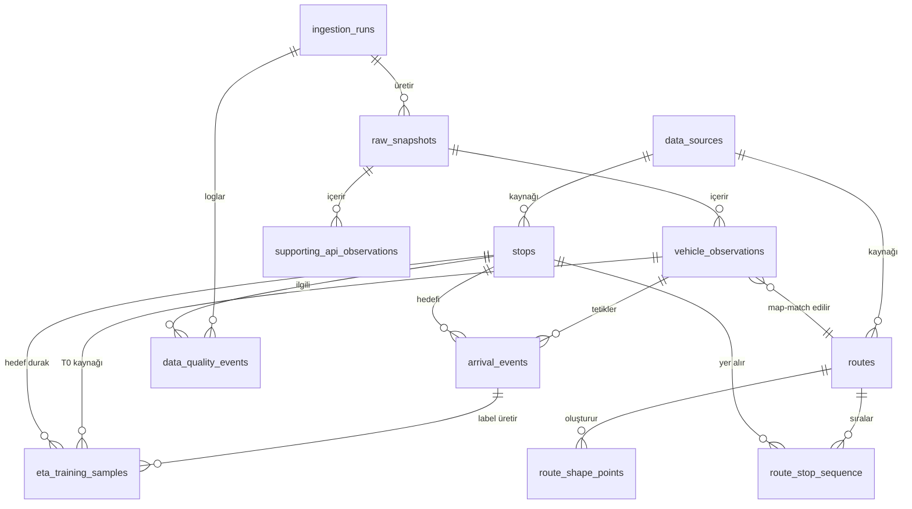

# İzmir Otobüs ETA – Faz 2: PostgreSQL/PostGIS Altyapısı

## Kurulum

**Temiz ortamda tek komutla kurulum:**

```bash
docker compose up -d postgis
```

`migrations/` klasörü `docker-entrypoint-initdb.d` olarak mount edildiği için,
volume boşken container ilk kez ayağa kalktığında tüm `.sql` dosyaları
sırayla (001, 002, ...) otomatik uygulanır.

**Şema değiştiyse ve volume zaten doluysa:**

```bash
./scripts/run_migrations.sh
```

**Sıfırdan tamamen temiz kurulum (tüm veriyi siler):**

```bash
./scripts/fresh_setup.sh
```

**pgAdmin:** http://localhost:5050 (admin@local.dev / admin_dev_only) — opsiyonel, istersen compose dosyasından silebilirsin.

## ER Diyagramı



## Tasarım Notları

- **Ham veri kaybı yok**: `raw_snapshots.raw_response` (JSONB) her API çağrısının
  tam cevabını saklar. Ayrı JSON dosyaları yerine tek storage katmanı.
- **Çoklu koordinat kaybı yok** (madde 1): `vehicle_observations.response_index`
  aynı response içindeki her noktayı ayrı satır olarak tutar; `UNIQUE (raw_snapshot_id, response_index)`.
- **"İlk nokta güncel" varsayımı yok**: `position_quality` varsayılan olarak
  `UNKNOWN_POSITION`; sınıflandırma ayrı bir analiz adımıyla (Faz 2 madde 1
  araştırması) doldurulacak, `position_quality_reason` ile gerekçelendirilecek.
- **Future leakage koruması** (madde 7): `eta_training_samples` üzerinde
  `CHECK (observed_at < actual_arrival_at)` constraint'i var.
- **Support API çapraz doğrulama** (madde 8): `supporting_api_observations`
  tek başına "zaman serisi kanıtı" değildir — aynı `vehicle_id` için zaman
  içindeki azalan `remaining_stop_count` değerleri sorgulanarak kullanılmalı.
  Bu mantık uygulama/ETL katmanında (Python) uygulanacak, DB seviyesinde
  sadece doğru veri modeli sağlanıyor.
- **Traceability**: `data_sources` tablosu ESHOT kaynaklarının URL, indirilme
  zamanı ve SHA-256 hash'ini tutar (madde 3).

## Sıradaki Adımlar

1. Bu şemayı `docker compose up -d` ile ayağa kaldır, `\dt` ile tabloları doğrula.
2. Faz 1 collector kodunu bu şemaya yazacak şekilde güncelleyeceğiz
   (raw_snapshots + vehicle_observations insert).
3. Ardından madde 1 (GPS belirsizliği araştırması) için 515 ve 121 hatlarında
   60-120 dk'lık gözlem toplama sürecine geçeceğiz.
